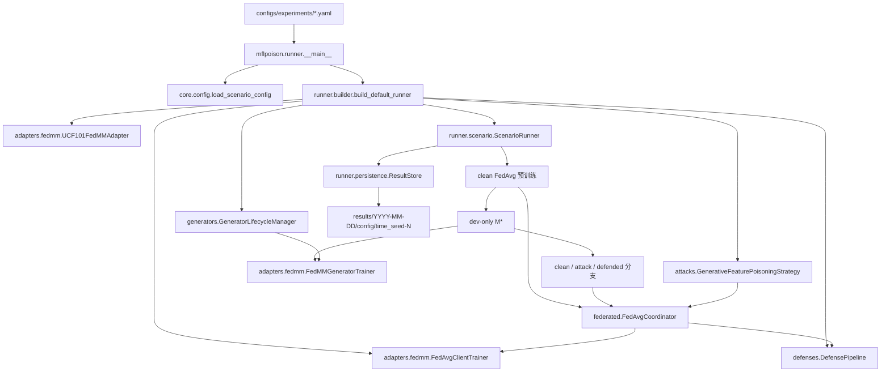

# 当前流程、调用关系与结果结构

本文按一次完整实验的实际执行顺序说明代码调用关系。当前唯一生产入口是：

```bash
python -m mflpoison.runner \
  --config configs/experiments/ucf101_fdmm_dtm_poison_0to1_defense.yaml
```

## 1. 总调用链



代码职责保持单向：配置描述实验，builder 组装对象，scenario 编排阶段，coordinator 执行联邦轮次，攻击只改变恶意客户端的数据视图，防御只处理服务器收到的客户端更新。

## 2. 参数设置

### 2.1 文件

| 文件 | 作用 |
|---|---|
| `configs/experiments/ucf101_fdmm_dtm_poison_0to1.yaml` | clean/attack 基准实验 |
| `configs/experiments/ucf101_fdmm_dtm_poison_0to1_defense.yaml` | 增加 defended 分支 |
| `configs/experiments/ucf101_fdmm_dtm_poison_0to1_smoke.yaml` | 最短连通性验证 |
| `configs/experiments/poison_strength/*.yaml` | 基于主配置覆盖少量超参数 |
| `mflpoison/core/config.py` | 配置 dataclass、严格字段检查、`base_config` 合并 |

派生配置只包含：

```yaml
base_config: ../ucf101_fdmm_dtm_poison_0to1.yaml
overrides:
  attack:
    malicious_client_count: 2
    poison_ratio: 0.5
  generator:
    epochs: 20
```

因此实验差异留在 YAML 中，不需要为每组超参数新增 Python 文件。入口会把最终合并后的八段配置写入 `config_resolved.yaml`。

### 2.2 八段配置到代码对象

| 配置段 | 主要消费者 |
|---|---|
| `dataset` | `UCF101FedMMAdapter` |
| `model` | adapter 模型构造与可选初始 checkpoint |
| `federation` | `FedAvgClientTrainer`、客户端采样和分支轮数 |
| `generator` | `FedMMGeneratorTrainer`、`GeneratorLifecycleManager` |
| `attack` | `AttackSpec`、恶意客户端选择、生成式中毒策略 |
| `defense` | detector、sanitizer、aggregator、`DefensePipeline` |
| `evaluation` | dev/test、0→1 定向攻击指标 |
| `results` | 默认结果根目录 |

## 3. 程序启动

`mflpoison/runner/__main__.py` 是唯一生产启动文件，依次执行：

1. 解析 `--config`、可选 `--seed` 和可选 `--run-dir`；
2. 调用 `load_scenario_config` 得到完整 `ScenarioConfig`；
3. 用 `--seed` 同时覆盖联邦和生成器 seed；
4. 生成本次 `run_dir` 并保存 `config_resolved.yaml`；
5. 调用 `runner.builder.build_default_runner`；
6. 执行 `ScenarioRunner.run()`；
7. 输出 M* hash、`summary.json` 路径和 `run_dir`。

## 4. 对象组装

`mflpoison/runner/builder.py` 将静态配置实例化为运行对象：

1. `UCF101FedMMAdapter`：定位 FedMM 的 audio/video 客户端、dev、test 特征，构造分类模型和评估器；
2. `FedAvgClientTrainer`：在一个客户端的 dataloader 上执行本地训练并返回 `ClientUpdate`；
3. clean `weighted_mean` 聚合器；
4. 攻击开启时，创建 DTM `FedMMGeneratorTrainer`、`GeneratorLifecycleManager` 和 `GenerativeFeaturePoisoningStrategy`；
5. 防御开启时，创建 Norm MAD/Cosine MAD detector、NormClipper、聚合器和 `DefensePipeline`；
6. 将这些对象注入 `ScenarioRunner`。

builder 只负责组装，不执行训练。

## 5. 联邦学习设置与执行

`mflpoison/runner/scenario.py` 的 `ScenarioRunner` 是阶段编排器：

1. adapter 准备数据并暴露训练客户端；
2. 根据 `federation.seed` 预生成 clean 预训练日程；
3. 根据 `seed + 1` 预生成各实验分支共用的客户端日程；
4. 创建初始全局模型；
5. 调用 `FedAvgCoordinator.train` 完成 clean FedAvg 预训练；
6. 只根据 dev 收敛指标选择 M*，test 不参与选模；
7. 从同一 M* 启动配置选中的 `clean`、`attack`、`defended` 分支。

`mflpoison/federated/coordinator.py` 的 `FedAvgCoordinator` 执行每一轮：

```text
全局 snapshot
  -> 按日程选客户端
  -> 为每个客户端取得独立 dataloader
  -> FedAvgClientTrainer.train
  -> ClientUpdate(delta)
  -> DefensePipeline.process
  -> 聚合后的下一轮 snapshot
  -> dev 评估与 RoundRecord
```

clean 和 attack 分支也通过同一个 `DefensePipeline.process` 服务器边界；未启用防御时管线不配置异常 detector，只执行正常校验与聚合。

## 6. 客户端与生成器

相关文件：

| 文件 | 作用 |
|---|---|
| `mflpoison/adapters/fedmm/ucf101.py` | 读取客户端 partition、dev、test，构造模型与评估 |
| `mflpoison/adapters/fedmm/client.py` | 包装 FedMM 本地训练并产生 `ClientUpdate` |
| `mflpoison/generators/lifecycle.py` | 管理每个恶意客户端的生成器训练/刷新状态 |
| `mflpoison/adapters/fedmm/generator.py` | 调用 DTM 或 temporal 生成器训练器 |
| `fed_multimodal/dtm_poison_gan/` | DTM 网络、损失和训练实现 |

客户端数据不会先集中到一个训练集。`ScenarioRunner` 每次只向 adapter 请求当前选中的一个客户端；每个恶意客户端的生成器也只使用该客户端自己的 partition。

默认 `offline_once` 生命周期会在 M* 后为每个恶意客户端训练一次生成器。生成器 checkpoint 写入：

```text
checkpoints/generators/<branch>/
```

对应的客户端、模型和训练 lineage 记录写入：

```text
generators/<branch>/<client-id>/
```

## 7. 恶意客户端中毒

中毒链路由 `ScenarioRunner._run_branch` 在客户端数据边界内触发：

```text
选中恶意客户端
  -> GeneratorLifecycleManager.ensure
  -> 取得该客户端生成器
  -> GenerativeFeaturePoisoningStrategy.prepare_dataloader
  -> 生成 condition_class=0 的特征
  -> 赋 assigned_train_label=1
  -> replace/append 到本地数据
  -> FedAvgClientTrainer 训练
  -> 带中毒来源信息的 ClientUpdate
```

当前 UCF101 攻击语义是：

- `condition_class = 0`；
- `assigned_train_label = 1`；
- `victim_eval_class = 0`；
- `goal_prediction_class = 1`。

也就是生成类 0 条件特征、按类 1 训练，并在 test 上评估 0→1 定向攻击成功率。`poison_ratio` 或 `poison_count` 决定预算，`start_round`、`end_round` 和 `every` 决定生效轮次。

## 8. 服务器防御

`mflpoison/defenses/pipeline.py` 的 `DefensePipeline` 只接收 `ClientUpdate` 和当前全局 snapshot，不接收客户端原始数据或生成器。处理顺序固定为：

1. `UpdateValidator` 校验更新结构、基线和数值；
2. detector 对合法更新计算异常分数；
3. `CompositeDecisionPolicy` 给出 accept、clip 或 reject；
4. `NormClipper` 裁剪需要处理的更新；
5. 配置的 aggregator 聚合剩余更新；
6. 返回决策、处理后更新、聚合结果和审计信息。

防御组件位于：

```text
mflpoison/defenses/
├── validation.py
├── detection.py
├── pipeline.py
├── update_filter/norm_clipping.py
└── robust_aggregation/
```

`defended` 分支开启完整 detector/sanitizer/aggregator 组合；clean 与 attack 分支提供没有异常检测器的正常服务器聚合基线。

## 9. 评估与结果

`ScenarioRunner` 在每轮使用 dev 指标追踪训练，在 M* 和各分支结束后使用 test 指标。`runner.persistence.ResultStore` 保存：

```text
results/YYYY-MM-DD/<config-name>/HH-MM-SS_seed-N/
├── config_resolved.yaml       # 完整实际配置
├── run_info.json              # seed、客户端、日程、运行信息
├── summary.json               # M*、分支 test/ASR、攻击暴露、防御指标
├── checkpoints/
│   ├── initial.pt
│   ├── m_star.pt
│   ├── <branch>_last.pt
│   └── generators/
├── generators/                # 每客户端生成器 lineage
└── rounds.pt                  # 所有阶段的逐轮记录
```

`results/` 及其日期、实验和运行子目录均由入口按需创建，不需要在仓库中预建。smoke 或测试结果验收后，应同时删除结果、缓存和已经为空的父目录。

显式 `--run-dir` 时使用指定目录；批处理脚本还会把 stdout/stderr 写入该目录的 `train.log`。

结果分析以三类文件为主：

- `config_resolved.yaml`：确认实际参数；
- `summary.json`：比较 clean、attack、defended 的效用、ASR 和检测指标；
- `rounds.pt`：检查客户端暴露、中毒是否生效以及服务器逐轮决策。

## 10. 多 GPU 批处理与监控

`scripts/run_experiments.sh` 是唯一批量实验脚本。每个参数格式为：

```text
GPU:CONFIG:SEED
```

例如：

```bash
PYTHON_BIN=/mnt/sda/mtzh/xp/envs/fedpoi-py39/bin/python \
bash scripts/run_experiments.sh \
  0:configs/experiments/poison_strength/clients1_poison20_gen20.yaml:42 \
  1:configs/experiments/poison_strength/clients2_poison50_gen20.yaml:42 \
  2:configs/experiments/poison_strength/clients3_poison50_gen50.yaml:42
```

脚本对每个作业设置 `CUDA_VISIBLE_DEVICES`，调用同一个 `python -m mflpoison.runner`，并维护：

```text
results/batches/YYYY-MM-DD/HH-MM-SS/status.tsv
```

状态为 `running`、`completed` 或 `failed`，每个作业的完整日志位于自己的 `train.log`。批量运行没有另一套训练逻辑，区别仍全部来自配置文件。

## 11. 目录边界

```text
fedpoi/
├── configs/experiments/       # 完整配置和参数变体
├── scripts/                   # 多 GPU 批处理
├── mflpoison/                 # 当前联邦攻防实现
├── fed_multimodal/            # 数据、模型和生成器兼容实现
├── experiments/               # 旧 checkpoint 人工分析工具
├── tests/                     # 自动化测试
├── docs/                      # 当前结构说明
└── results/                   # 运行时按需创建，不进入 Git
```

生产训练不要从 `experiments/` 另建入口，也不要为超参数组合复制 Python 文件。一次实验应由一个语义明确的 YAML 配置和一个独立、可检索的结果目录对应。
