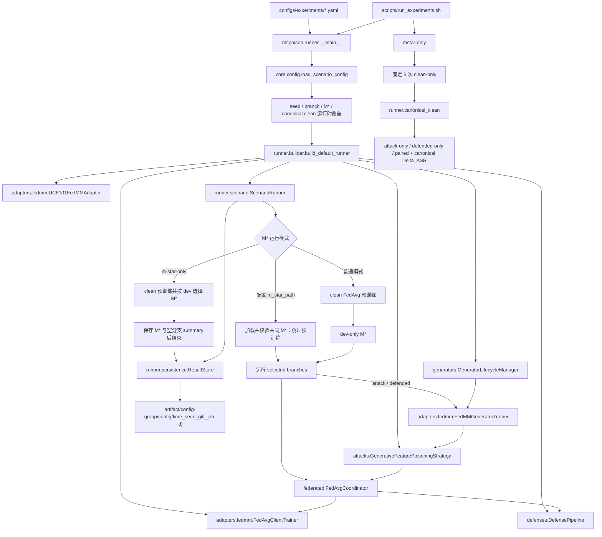
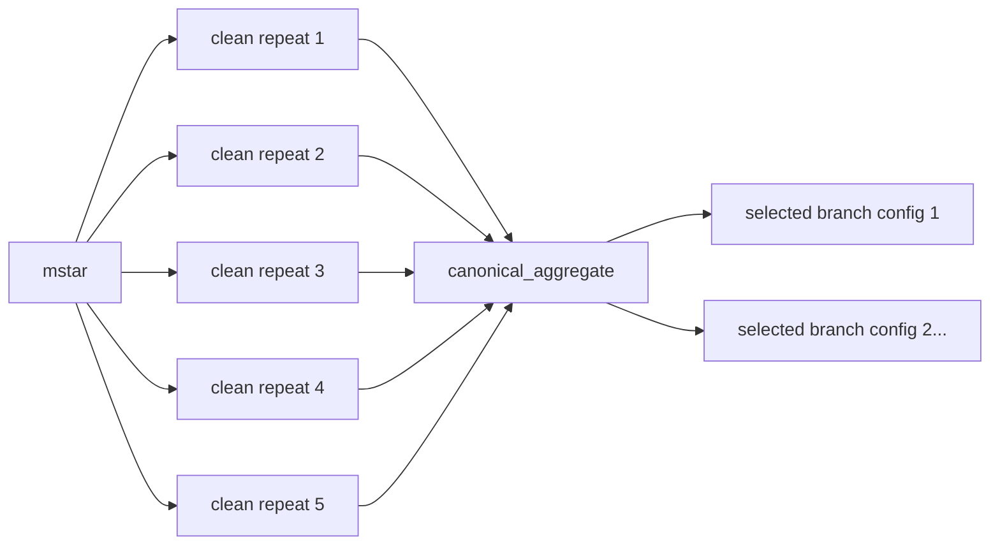

# 当前流程、调用关系与结果结构

本文按一次完整实验的实际执行顺序说明代码调用关系。当前唯一生产入口是：

```bash
python -m mflpoison.runner \
  --config configs/experiments/ucf101_fdmm_dtm_poison_0to1_defense.yaml
```

## 1. 总调用链



代码职责保持单向：配置描述实验，builder 组装对象，scenario 编排阶段，coordinator 执行联邦轮次，攻击只改变恶意客户端的数据视图，防御只处理服务器收到的客户端更新。

## 2. 参数设置

### 2.1 文件

| 文件 | 作用 |
|---|---|
| `configs/experiments/ucf101_fdmm_dtm_poison_0to1.yaml` | clean/attack 基准实验 |
| `configs/experiments/ucf101_fdmm_dtm_poison_0to1_defense.yaml` | 增加 defended 分支 |
| `configs/experiments/ucf101_fdmm_dtm_poison_0to1_smoke.yaml` | 最短连通性验证 |
| `configs/experiments/ucf101_dtm_poison_strength/*.yaml` | 基于主配置显式设置关键实验参数，并声明为 attack-only |
| `configs/experiments/ucf101_dtm_poison_strength_defense/*.yaml` | 与攻击矩阵参数一一对应，启用服务器防御并声明为 defended-only |
| `configs/experiments/ucf101_dtm_poison_strength_separate_gan_learning_rates/*.yaml` | 沿用 11 组攻击者参数，设置 `lrG=3e-4`、`lrD=5e-5` 并配对运行 attack/defended |
| `mflpoison/core/config.py` | 配置 dataclass、严格字段检查、`base_config` 合并 |

派生配置只包含：

```yaml
base_config: ../ucf101_fdmm_dtm_poison_0to1.yaml
overrides:
  federation:
    branches: [attack]
  attack:
    malicious_client_count: 2
    poison_ratio: 0.5
  generator:
    epochs: 20
```

因此实验超参数差异留在 YAML 中，不需要为每组组合新增 Python 文件。入口还可以为批次阶段覆盖 seed、分支、共同 M* 路径和 canonical clean 路径；这些覆盖会先写回 `ScenarioConfig`，再把最终八段有效配置写入 `config_resolved.yaml`。

`generator.learning_rate` 映射为 DTM 的 `lr_g`；可选的 `generator.discriminator_learning_rate` 映射为 `lr_d`。未设置后者时继续使用与 `lr_g` 相同的值，保持已有配置行为。

### 2.2 八段配置到代码对象

| 配置段 | 主要消费者 |
|---|---|
| `dataset` | `UCF101FedMMAdapter` |
| `model` | adapter 模型构造与可选初始 checkpoint |
| `federation` | `FedAvgClientTrainer`、客户端采样、分支轮数、`m_star_path` 和 `m_star_only` |
| `generator` | `FedMMGeneratorTrainer`、`GeneratorLifecycleManager` |
| `attack` | `AttackSpec`、恶意客户端选择、生成式中毒策略 |
| `defense` | detector、sanitizer、aggregator、`DefensePipeline` |
| `evaluation` | dev/test、0→1 定向攻击指标和 `canonical_clean_path` |
| `artifact` | 默认运行产物根目录 |

## 3. 程序启动

`mflpoison/runner/__main__.py` 是唯一场景训练入口。当前参数为：

| 参数 | 作用 |
|---|---|
| `--config PATH` | 必填，读取场景 YAML 或 JSON |
| `--run-dir PATH` | 指定本次运行的唯一产物目录 |
| `--seed N` | 同时覆盖 federation 与 generator seed |
| `--branch NAME` | 只运行 `clean`、`attack` 或 `defended`；可重复指定多个分支 |
| `--m-star-path PATH` | 复用共同 M*，跳过 clean 预训练 |
| `--m-star-only` | 只训练、选择和保存 M*，不启动任何实验分支 |
| `--canonical-clean PATH` | 为 attack-only/defended-only 运行加载 canonical clean JSON，并据此计算 Delta_ASR |

`--m-star-only` 不能和 `--branch`、`--m-star-path` 或 `--canonical-clean` 同时使用。`--canonical-clean` 要求同时提供共同 `--m-star-path`，且选中 attack 或 defended 分支、不能同时运行 clean。

入口依次执行：

1. 解析上述命令行参数；
2. 调用 `load_scenario_config` 得到完整 `ScenarioConfig`；
3. 应用 seed、分支、M* 和 canonical clean 运行时覆盖；
4. 根据配置名、日期时间、seed 和 Git 短哈希生成 `run_dir`，并保存 `config_resolved.yaml`；
5. 调用 `runner.builder.build_default_runner`；
6. 执行 `ScenarioRunner.run()`；
7. 输出 M* hash、`summary.json` 路径和 `run_dir`。

## 4. 对象组装

`mflpoison/runner/builder.py` 将静态配置实例化为运行对象：

1. `UCF101FedMMAdapter`：定位 FedMM 的 audio/video 客户端、dev、test 特征，构造分类模型和评估器；
2. `FedAvgClientTrainer`：在一个客户端的 dataloader 上执行本地训练并返回 `ClientUpdate`；
3. clean `weighted_mean` 聚合器；
4. 攻击开启时，创建 DTM `FedMMGeneratorTrainer`、`GeneratorLifecycleManager` 和 `GenerativeFeaturePoisoningStrategy`；
5. 防御开启时，创建 Norm MAD/Cosine MAD detector、NormClipper、聚合器和 `DefensePipeline`；
6. 将这些对象注入 `ScenarioRunner`。

builder 只负责组装，不执行训练。

## 5. 联邦学习设置与执行

`mflpoison/runner/scenario.py` 的 `ScenarioRunner` 是阶段编排器：

1. adapter 准备数据并暴露训练客户端；
2. 根据 `federation.seed` 预生成 clean 预训练日程；
3. 根据 `seed + 1` 预生成各实验分支共用的客户端日程；
4. 创建初始全局模型；
5. 没有配置 `m_star_path` 时，调用 `FedAvgCoordinator.train` 完成 clean FedAvg 预训练；配置了 `m_star_path` 时，校验 checkpoint 的 partition 和模型规格后直接复用；
6. 只根据 dev 收敛指标选择 M*，test 不参与选模；
7. `m_star_only=true` 时保存 M* 和空分支 summary 后结束；否则从同一 M* 启动配置选中的 `clean`、`attack`、`defended` 分支；
8. 提供 canonical clean 时，在启动分支前校验 seed、partition、M* hash、分支日程和 0→1 攻击方向。

### 5.1 共同 M* 与 canonical clean 协议

批量超参数筛选不再让每个攻击配置各自重跑 clean。每个 seed 的固定执行顺序为：

```text
mstar-only
  -> 共同 checkpoints/m_star.pt
  -> clean-only repeat 1..5（都复用该 M*）
  -> canonical clean 聚合
  -> attack-only、defended-only 或配对配置队列（复用同一 M* 和同一 canonical clean）
```

五次 clean 使用相同 seed、partition、客户端日程和 M*。`mflpoison.runner.canonical_clean` 固定只接受恰好五个、路径互不重复且已完成的 clean-only `summary.json`，并检查：

- 五次均明确复用请求的共同 M*；
- partition hash、M* hash 和 M* 来源路径一致；
- branch schedule、victim/goal class 和源类样本数一致；
- dataset/model/本地训练/evaluation 的共同可比协议一致；
- Git commit、dirty 状态和运行源码树 hash 一致；
- `attack_success_count / attack_source_sample_count` 与 ASR 一致；
- 五次 clean 的 experiment ID 唯一且与各自 run directory 一致；
- 共同 M* 来自同 seed 的 completed、m-star-only 运行，其 experiment ID、checkpoint hash、partition 和源码身份均与五次 clean 一致。

聚合结果同时保留五次各自的成功数、源类总数和 ASR，计算 ASR 算术平均值 `asr_canonical_clean` 以及总体标准差。attack 加载 baseline 时会重新读取五份来源 summary/manifest 和共同 M* 并重建聚合结果，所以 baseline 使用期间这些来源产物必须保留在原路径。攻击分支的正式增量为：

```text
Delta_ASR(seed, config) = ASR_attack(seed, config) - ASR_canonical_clean(seed)
```

canonical clean 不跨 seed 复用。当前 fold1 的每次源类总数应各自报告，五次 clean 不合并成一个扩大后的分母。

`mflpoison/federated/coordinator.py` 的 `FedAvgCoordinator` 执行每一轮：

```text
全局 snapshot
  -> 按日程选客户端
  -> 为每个客户端取得独立 dataloader
  -> FedAvgClientTrainer.train
  -> ClientUpdate(delta)
  -> DefensePipeline.process
  -> 聚合后的下一轮 snapshot
  -> dev 评估与 RoundRecord
```

clean 和 attack 分支也通过同一个 `DefensePipeline.process` 服务器边界；未启用防御时管线不配置异常 detector，只执行正常校验与聚合。

## 6. 客户端与生成器

相关文件：

| 文件 | 作用 |
|---|---|
| `mflpoison/adapters/fedmm/ucf101.py` | 读取客户端 partition、dev、test，构造模型与评估 |
| `mflpoison/adapters/fedmm/client.py` | 包装 FedMM 本地训练并产生 `ClientUpdate` |
| `mflpoison/generators/lifecycle.py` | 管理每个恶意客户端的生成器训练/刷新状态 |
| `mflpoison/adapters/fedmm/generator.py` | 调用 DTM 或 temporal 生成器训练器 |
| `fed_multimodal/dtm_poison_gan/` | DTM 网络、损失和训练实现 |

客户端数据不会先集中到一个训练集。`ScenarioRunner` 每次只向 adapter 请求当前选中的一个客户端；每个恶意客户端的生成器也只使用该客户端自己的 partition。

默认 `offline_once` 生命周期会在 M* 后为每个恶意客户端训练一次生成器。生成器 checkpoint 写入：

```text
checkpoints/generators/<branch>/
```

对应的客户端、模型和训练 lineage 记录写入：

```text
generators/<branch>/<client-id>/
```

## 7. 恶意客户端中毒

中毒链路由 `ScenarioRunner._run_branch` 在客户端数据边界内触发：

```text
选中恶意客户端
  -> GeneratorLifecycleManager.ensure
  -> 取得该客户端生成器
  -> GenerativeFeaturePoisoningStrategy.prepare_dataloader
  -> 生成 condition_class=0 的特征
  -> 赋 assigned_train_label=1
  -> replace/append 到本地数据
  -> FedAvgClientTrainer 训练
  -> 带中毒来源信息的 ClientUpdate
```

当前 UCF101 攻击语义是：

- `condition_class = 0`；
- `assigned_train_label = 1`；
- `victim_eval_class = 0`；
- `goal_prediction_class = 1`。

也就是生成类 0 条件特征、按类 1 训练，并在 test 上评估 0→1 定向攻击成功率。`poison_ratio` 或 `poison_count` 决定预算，`start_round`、`end_round` 和 `every` 决定生效轮次。

## 8. 服务器防御

`mflpoison/defenses/pipeline.py` 的 `DefensePipeline` 只接收 `ClientUpdate` 和当前全局 snapshot，不接收客户端原始数据或生成器。处理顺序固定为：

1. `UpdateValidator` 校验更新结构、基线和数值；
2. detector 对合法更新计算异常分数；
3. `CompositeDecisionPolicy` 给出 accept、clip 或 reject；
4. `NormClipper` 裁剪需要处理的更新；
5. 配置的 aggregator 聚合剩余更新；
6. 返回决策、处理后更新、聚合结果和审计信息。

防御组件位于：

```text
mflpoison/defenses/
├── validation.py
├── detection.py
├── pipeline.py
├── update_filter/norm_clipping.py
└── robust_aggregation/
```

`defended` 分支开启完整 detector/sanitizer/aggregator 组合；clean 与 attack 分支提供没有异常检测器的正常服务器聚合基线。

## 9. 评估与结果

`ScenarioRunner` 在每轮使用 dev 指标追踪训练，在 M* 和各分支结束后使用 test 指标。定向攻击评估会同时保存 `attack_success_count`、`attack_source_sample_count`、0–1 范围的 `attack_success_rate` 和百分比值。`runner.persistence.ResultStore` 保存：

```text
artifact/<config-name>/<YYYYMMDD-HHMMSS>_seed-<N>_git-<short-sha>/
artifact/<config-group>/<config-name>/<YYYYMMDD-HHMMSS>_seed-<N>_git-<short-sha>/
├── config_resolved.yaml       # 完整实际配置
├── run_manifest.json          # seed、提交、dirty/source hash、客户端、日程、运行环境
├── summary.json               # M*、分支 test/ASR、基线来源、攻击暴露、防御指标
├── checkpoints/
│   ├── initial.pt
│   ├── m_star.pt
│   ├── <branch>_last.pt
│   └── generators/
├── generators/                # 每客户端生成器 lineage
└── round_records.pt           # 所有阶段的逐轮记录
```

`artifact/` 及其实验、配置和运行子目录均由入口按需创建，不需要在仓库中预建。smoke 或测试产物验收后，应立即删除产物、缓存和已经为空的父目录。

显式 `--run-dir` 时使用指定目录；批处理脚本还会把 stdout/stderr 写入该目录的 `train.log`。批次 run ID 会在原有时间、seed、Git 短哈希后附加唯一 job ID，避免相同配置、seed 的五次 clean 在同秒启动时写入同一目录；工作区非 clean 时 Git 标识再附加 `-dirty`，manifest 同时保存可比较的运行源码树 hash。

`summary.json` 当前 schema 为 3。没有外部 canonical clean、且同次运行包含 clean 时，攻击分支的 `delta_baseline` 为 `run_clean`；attack-only 使用外部基线时，`delta_baseline` 为 `canonical_clean`，同时写入 canonical ASR、`delta_attack_success_rate` 和 `delta_asr_percentage_points`。外部基线的 seed、partition、M*、日程、攻击方向、源类总数、共同训练协议或源码身份有任一不一致，运行会在生成器训练前失败，而不是写出不可比的增量。单独运行 attack/defended 分支时不能省略共同 M* 和 canonical clean。

每个 seed 的 canonical 聚合产物位于：

```text
artifact/batches/<batch-id>/canonical_clean_seed-<N>.json
```

其中记录共同 M*、partition、攻击方向、五次 clean 明细、`asr_canonical_clean` 和总体标准差；同目录的 `.log` 保存聚合命令输出。

结果分析以四类文件为主：

- `config_resolved.yaml`：确认实际参数；
- `summary.json`：比较 clean、attack、defended 的效用、ASR、Delta_ASR 和检测指标；
- `canonical_clean_seed-<N>.json`：确认共同 M* 下五次 clean 的分布与正式基线；
- `round_records.pt`：检查客户端暴露、中毒是否生效以及服务器逐轮决策。

## 10. 多 GPU 批处理与监控

`scripts/run_experiments.sh` 是唯一批量实验脚本。位置参数是待运行的单支线或 attack/defended 配对队列，每项格式为：

```text
CONFIG:SEED
```

GPU 不再写入单项任务。调度器持续从 `--gpus` 指定的池中选择空闲卡；默认池为 `0,1,2,3`。例如：

```bash
PYTHON_BIN=/mnt/sda/mtzh/xp/envs/fedpoi-py39/bin/python \
bash scripts/run_experiments.sh \
  --gpus 0,1,2,3 \
  --canonical-clean-config configs/experiments/ucf101_fdmm_dtm_poison_0to1.yaml \
  --experiment-branches attack,defended \
  configs/experiments/ucf101_dtm_poison_strength_separate_gan_learning_rates/malicious-clients-1_poison-20pct_generator-epochs-5.yaml:42 \
  configs/experiments/ucf101_dtm_poison_strength_separate_gan_learning_rates/malicious-clients-2_poison-50pct_generator-epochs-20.yaml:42
```

可用选项和环境覆盖为：

| 接口 | 默认值 | 作用 |
|---|---:|---|
| `--gpus LIST` | `0,1,2,3` | 逗号分隔的 GPU 池 |
| `--canonical-clean-config PATH` | `configs/experiments/ucf101_fdmm_dtm_poison_0to1.yaml` | 生成共同 M* 和五次 clean 使用的配置 |
| `--experiment-branch NAME` | `attack` | 统一运行 `attack` 或 `defended` 分支 |
| `--experiment-branches LIST` | 无 | 在同一个 runner 任务中运行逗号分隔的 `attack,defended` 配对分支；不能与单数选项并用 |
| `--reuse-m-star-path PATH` | 无 | 与 canonical 路径成对提供，跳过 fresh 基线链 |
| `--reuse-canonical-clean PATH` | 无 | 与 M* 路径成对提供，且只允许一个唯一 seed |
| `--canonical-source-policy POLICY` | `exact` | 复用路径的源码策略；跨批准提交必须显式使用 `approved_reuse` |
| `--monitor-interval SECONDS` | `30` | 子进程和 GPU 轮询间隔 |
| `--idle-memory-mib MIB` | `1024` | 判定空闲卡允许的最大已用显存 |
| `PYTHON_BIN` | `python` | runner 和聚合器 Python |
| `ARTIFACT_ROOT` | `artifact` | 运行产物根目录 |
| `BATCH_ID` | 当前时间 | 显式批次 ID；已存在的批次目录会被拒绝 |
| `NVIDIA_SMI_BIN` | `nvidia-smi` | GPU 查询程序路径 |
| `SCHEDULER_LOCK_FILE` | 主机级固定锁文件 | 仅供隔离测试或确认不会争用 GPU 的受控环境覆盖；普通批次不修改 |

默认模式固定重新训练 M* 和 5 次 clean，不提供把 canonical clean 改成其他次数的批处理参数。经批准使用复用路径时，调度器会在预检后持续复核 clean Git 来源、canonical 的严格重建结果以及 canonical/M* 文件哈希；任一来源变化都会中止批次。配置必须位于当前仓库的 `configs/experiments/`，seed 必须位于 `0..4294967295`；重复的 `CONFIG:SEED`、不存在的配置、重复/不存在的 GPU 和不安全的 batch ID 会在启动任务前被拒绝。

### 10.1 调度 DAG

调度器先从实验队列提取所有不同 seed，再为每个 seed 创建：



- `mstar` 调用 runner 的 `--m-star-only`；
- 五个 `clean` 调用 `--branch clean --m-star-path <共同 M*>`；
- `canonical_aggregate` 是不占 GPU 的短任务，调用 `python -m mflpoison.runner.canonical_clean`；
- 实验任务调用一个或两个 `--branch attack|defended`，并统一传入 `--m-star-path <共同 M*> --canonical-clean <聚合 JSON>`；配对任务在 `status.tsv` 中记录为 `attack_defended`。

单 seed 且四卡均空闲时，M* 完成后前四个 clean 会先占满四卡；任一 clean 结束释放 GPU 后，第五个自动补位。只有五个 clean 全部成功，聚合任务才会运行；只有聚合成功，对应 seed 的单支线或配对队列才会开始。

### 10.2 GPU 空闲判定

每张候选卡必须同时满足：

1. 没有被本调度器的 running 作业占用；
2. `nvidia-smi --query-compute-apps=pid` 没有报告外部 compute 进程；
3. `memory.used` 不高于 `--idle-memory-mib`。

启动任务后会立即把 GPU 记入调度器内部占用表，再设置 `CUDA_VISIBLE_DEVICES` 启动 runner，避免 CUDA 进程尚未出现在 `nvidia-smi` 时重复派发。主机级全局 `flock` 保证同一主机只运行一个调度器实例；`SCHEDULER_LOCK_FILE` 只在隔离测试或已确认不会争用 GPU 的受控环境中覆盖。

### 10.3 状态与失败传播

调度器原子更新：

```text
artifact/batches/<YYYYMMDD-HHMMSS>/status.tsv
```

GPU runner 只有在退出码为 0 且 `run_manifest.json` 顶层状态为 `completed` 时才会被标记完成。收到 `HUP`、`INT` 或 `TERM` 时，调度器停止派发，终止并回收各作业的独立进程组，把所有未完成任务原子更新为 `failed`（`failure_reason=scheduler_interrupted:<signal>`），再退出并释放主机锁。若状态文件无法继续原子写入，调度器也会停止全部已启动作业，而不会在失去队列记录后继续实验。

也可以用显式 `BATCH_ID` 替代时间目录名。字段固定为：

```text
job_id  stage  experiment  seed  repeat  depends_on  gpu  pid  status
exit_code  queued_at  started_at  finished_at  config  run_dir  failure_reason
```

状态为 `queued`、`running`、`completed` 或 `failed`。GPU 子进程退出码为 0 且生成 `run_manifest.json` 才标记 completed；其他情况保存退出码及 `failure_reason`。如果上游失败，所有仍未启动的直接和间接下游任务都标记 failed、退出码记为 125，并写入 `dependency_failed:<job-id>`，不会误启动 attack。批次存在任一 failed 任务时，脚本最终返回非零。

### 10.4 批次产物

```text
artifact/
├── canonical_clean/
│   ├── m_star/<batch>_seed-<N>_git-<sha>_mstar-seed-<N>/
│   └── clean-repeat-<R>/<batch>_seed-<N>_git-<sha>_clean-seed-<N>-repeat-<R>/
├── [<config-group>/]<attack-config>/<batch>_seed-<N>_git-<sha>_attack-<ordinal>-seed-<N>/
└── batches/<batch-id>/
    ├── status.tsv
    ├── canonical_clean_seed-<N>.json
    └── canonical_clean_seed-<N>.log
```

每个 GPU 作业的 stdout/stderr 位于自己的 `train.log`。批量运行没有另一套训练逻辑：M*、clean 和 attack 仍调用同一个 runner，超参数差异仍由 YAML 决定；批处理脚本只负责阶段覆盖、依赖、GPU 分配和状态持久化。

## 11. 目录边界

```text
fedpoi/
├── configs/experiments/       # 完整配置和参数变体
├── scripts/                   # 多 GPU 批处理
├── mflpoison/                 # 当前联邦攻防实现
├── fed_multimodal/            # 数据、模型和生成器兼容实现
├── experiments/               # 旧 checkpoint 人工分析工具
├── tests/                     # 自动化测试
├── docs/                      # 当前结构说明
└── artifact/                  # 运行时按需创建，不进入 Git
```

生产训练不要从 `experiments/` 另建入口，也不要为超参数组合复制 Python 文件。一次实验应由一个语义明确的 YAML 配置和一个独立、可检索的产物目录对应。
