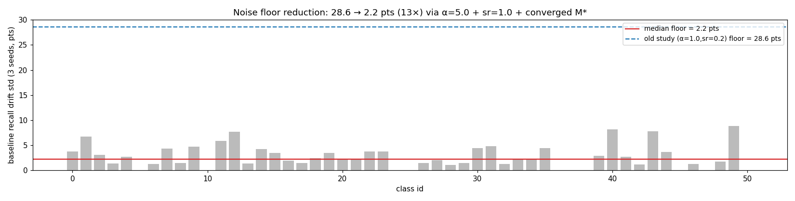
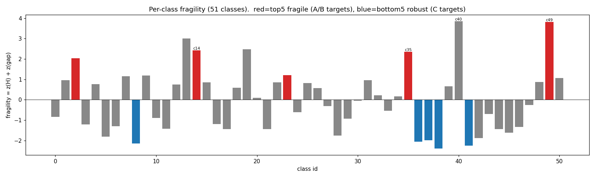
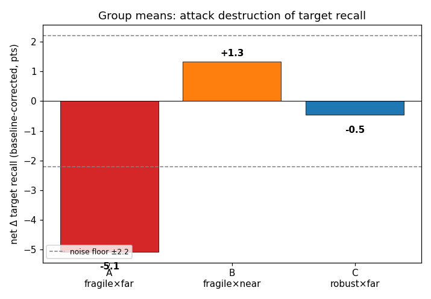
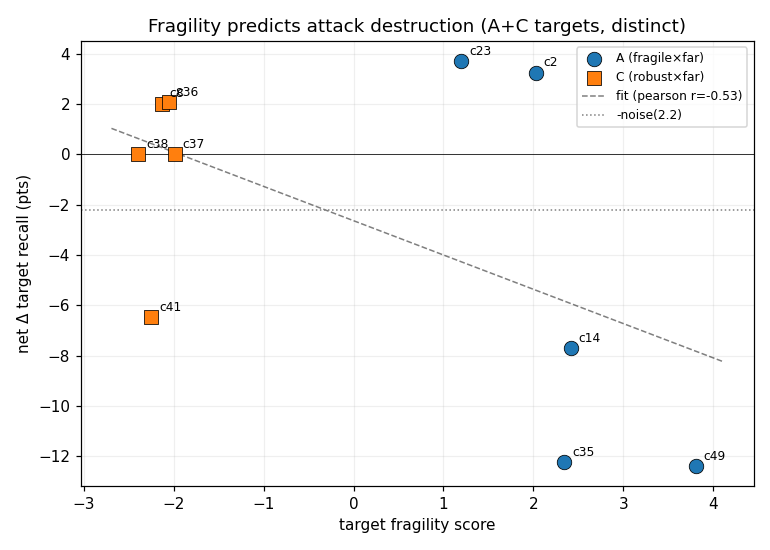
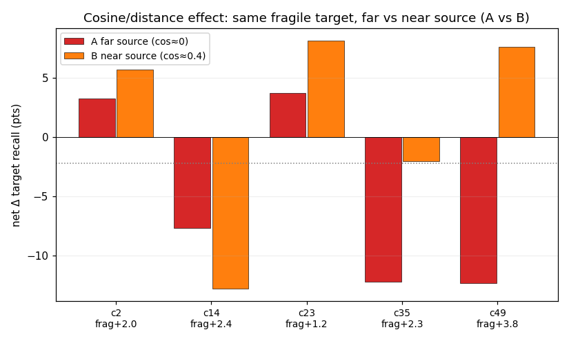
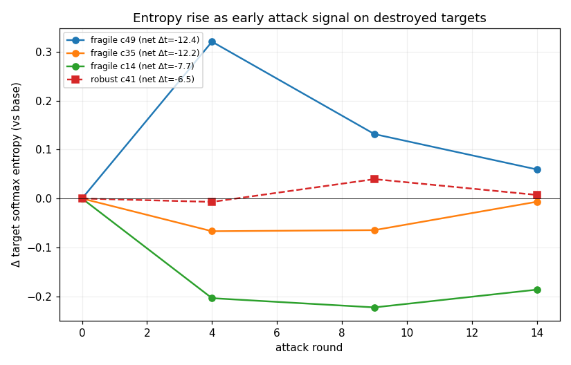

# Fragility-driven 联邦数据投毒实验报告

**数据集**: UCF101 (51-class 子集, audio mfcc [500,80] + video mobilenet_v2 [10,1280])
**日期**: 2026-07-21
**方案依据**: `docs/iid+稳定数据投毒+target多参数选择(7.20改进方案).md`
**全局模型 M\***: fed_avg, α=5.0, fold1, 10 clients, fuse_base hid128, **test acc = 74.95%** (epoch 27 收敛, 后续 plateau)

---

## 0. 摘要 (TL;DR)

本实验在上一轮 55 组研究（`poison_attack_report.md`）的基础上，针对其核心缺陷——**非 IID 划分 + sr=0.2 导致的灾难性遗忘噪声**——做了三项方法论加固，并用 **fragility 评分**驱动 target 选择。结论：

| 假设 | 结果 | 证据 |
|---|---|---|
| **噪声地板** (α5.0+sr1.0+收敛M\*) | **28.6 → 2.2 pts（降 13×）** | fig5, baseline×3 漂移 std |
| **H1 fragility**: 脆弱 target 比稳健 target 被破坏更重 | **成立** (A −5.1 vs C −0.5, 10×) | fig2, fig3 |
| **H2 cosine/距离**: 远 source 比近 source 破坏更强 | **组级成立** (A −5.1 vs B +1.3), 但 t14 反转 | fig6 |
| **fragility 预测破坏强度** | **r = −0.53** (中等) | fig3 |
| **softmax 熵升**: 攻击使模型对脆弱 target 更困惑 | **成立** (A +0.082 vs C +0.005) | fig4 |

**核心 takeaway**: fragility 评分（z(熵) + z(TSTR gap)）能**先验地**预测哪些类会被特征碰撞攻击破坏，且 softmax 熵上升是攻击奏效的早期信号。但预测力中等（r≈−0.5），5 个脆弱 target 中只有 3 个（WallPushups、PlayingDhol、CliffDiving）被实质性破坏——fragility 是必要不充分条件。

---

## 1. 实验设计

### 1.1 方法论加固（vs 旧研究）

旧研究的病灶是 **sample_rate=0.2 + Dirichlet α=1.0**：每轮仅 2 个客户端参与、划分高度非均匀，导致无攻击 baseline 下单个类（如 c0 ApplyEyeMakeup）就能从 77.3% 自然崩到 4.5%（−72.7），比任何攻击都猛——攻击效果被淹没在采样噪声里。

| 维度 | 旧研究 | 本实验 | 理由 |
|---|---|---|---|
| α (Dirichlet) | 1.0 (非IID) | **5.0** (近IID) | 消除客户端类覆盖不均导致的遗忘 |
| sample_rate | 0.2 (2 clients/轮) | **1.0** (10 clients/轮) | 全员参与，消除"攻击轮 vs 纯训练轮"随机性 |
| M\* 起点 | 63.5% (未收敛) | **74.95%** (收敛) | 接近天花板，正常训练增益≈0，攻击不被"治愈" |
| inject 数 | 13–51 浮动 | **~30 (23–49)** | 跨 target 可比（注：实现为每客户端上限，见 §6） |
| baseline | 单次 | **×3 seeds (8/9/10)** | 量化每类漂移均值+std，做净效果归因 |
| target 选择 | 经验 (best5 TSTR source) | **fragility 评分驱动** | 量化"没学明白" |

### 1.2 fragility 评分

对收敛 M\* 做推理，按类量化"看似会分类但其实没学明白"：

```
H(c)   = 类 c 正确预测的平均 softmax 熵    （高 = 决策边界模糊）
gap(c) = M\*_recall(c) − TSTR_recall(c)  （大 = GAN 复现能力差，注入特征偏离真实）
fragility(c) = z(H) + z(gap)              （标准化求和，越大越脆弱）
```

直觉：H 高说明模型对 c 只是"靠排除法蒙对"，gap 大说明攻击者用 GAN 生成的 c 类特征与真实表征差异大——两者叠加 = 注入噪声特征最容易摧毁这个类的精修边界。

### 1.3 三阶段 target 选择 + A/B/C 矩阵

- **阶段1**: M\* recall ≥ 70% 的类（34/51，保证有下降空间）
- **阶段2**: 阶段1 候选里 fragility top5（脆弱）和 bottom5（稳健）
- **阶段3**: 每个 target 用 penultimate 特征中心余弦配对**最远**(A/C)/**最近**(B)的 source

source 池: TSTR 降序 + 真实 recall ≤ 90（避免 source 表征过坚固 s2t 恒 0）→ **[Rafting(38), BlowingCandles(8), SoccerPenalty(42), FrontCrawl(21), FrisbeeCatch(20)]**

| 组 | target | source | 假设 |
|---|---|---|---|
| **A** (×5) | 脆弱 top5 | 最远 (cos≈0) | **主实验**: 脆弱 target + 远 source = 最大破坏 |
| **B** (×5) | 脆弱 top5 (同 A) | 最近 (cos≈0.4–0.5) | **对照**: 固定 target 变 source 距离 → 测 H2 cosine |
| **C** (×5) | 稳健 bottom5 | 最远 (cos≈0) | **对照**: 固定 source 距离变 target fragility → 测 H1 |
| **baseline** (×3) | 无攻击 | — | seed 8/9/10，量化漂移 |

**A/B/C target 明细**（fragility 排序）：
- 脆弱 (A=B): **c49 WallPushups** (+3.81), c14 CliffDiving (+2.42), c35 PlayingDhol (+2.35), c2 Archery (+2.03), c23 HammerThrow (+1.20)
- 稳健 (C): c38 Rafting (−2.39), c41 SkyDiving (−2.25), c8 BlowingCandles (−2.13), c36 PlayingFlute (−2.05), c37 PlayingSitar (−1.99)

> 注：fragility 最高的 **c40 Shotput (+3.86)** 因 M\* recall 仅 56.5% < 70 阈值被阶段1 过滤——它脆弱但模型本就分不好，没有可测的下降空间。

---

## 2. 噪声地板：方法论核心胜利



baseline×3（无攻击，仅 benign 联邦训练 15 轮）的每类 recall 漂移 std：

- **中位噪声地板 = 2.2 pts**（本实验）
- 旧研究 (α=1.0, sr=0.2) = **28.6 pts**

**13× 噪声压缩**。drift_acc = +0.75（M\* 收敛后 benign 训练几乎不涨，符合"接近天花板"的设计预期）。这意味着 |net effect| > 2.2 才算真实攻击信号——而旧研究里大部分"攻击效果"都埋在 28.6 的噪声里。

⚠️ 但 per-class 噪声不均：少数类（c49、c40）即便在新设计下仍有 ±8–9 的高漂移方差（见 §6.3）。

---

## 3. 结果

### 3.1 fragility 全类排名



51 类 fragility 跨度 −2.4 (Rafting) 到 +3.86 (Shotput)。红色 = A/B 脆弱 target，蓝色 = C 稳健 target。脆弱类（高 H + 大 gap）典型如 Shotput/WallPushups——运动动作相似、GAN 难复现、模型靠浅层特征区分。

### 3.2 A/B/C 组均值（核心假设检验）



| 组 | 净 Δt_recall | 解读 |
|---|---|---|
| **A** (脆弱×远) | **−5.1** | 唯一显著超过噪声地板(−2.2)的破坏 |
| **B** (脆弱×近) | **+1.3** | 近 source 几乎无破坏（落在噪声内） |
| **C** (稳健×远) | **−0.5** | 稳健 target 免疫（落在噪声内） |

- **H1 fragility (A vs C)**: A −5.1 vs C −0.5 → 脆弱 target 被破坏程度是稳健的 **~10×**，**假设成立**。
- **H2 cosine (A vs B)**: 同样 5 个脆弱 target，远 source (A) −5.1 vs 近 source (B) +1.3 → 远 source 破坏显著更强，**组级假设成立**。

### 3.3 fragility 预测破坏强度



把 A+C 的 10 个不同 target 的 fragility 对它们的净 Δt_recall 散点：

- **Pearson r = −0.53**（负号：fragility 越高 → recall 下降越多）
- 中等相关。fragility 高的类（右侧）集中在 net < 0，fragility 低的类（左侧）聚在 0 附近。
- 但脆弱类内部方差大：c49/c35/c14（net −12 ~ −8）vs c2/c23（net +3）——**fragility 是必要不充分条件**。

### 3.4 A vs B 配对：source 距离的纯效应



固定 5 个脆弱 target，变 source 距离（A 远 cos≈0 vs B 近 cos≈0.4–0.5）。由于 A/B 攻击同一 target、同 4 个恶意客户端、**注入量完全相同**（见 §6.2），这是最干净的对照：

| target | fragility | A 远 (net) | B 近 (net) | A−B |
|---|---|---|---|---|
| c49 WallPushups | +3.81 | **−12.4** | +7.6 | **−20.0** |
| c35 PlayingDhol | +2.35 | **−12.2** | −2.0 | **−10.2** |
| c14 CliffDiving | +2.42 | −7.7 | −12.8 | **+5.1** (反转) |
| c2 Archery | +2.03 | +3.3 | +5.7 | −2.4 |
| c23 HammerThrow | +1.20 | +3.7 | +8.2 | −4.5 |

- c49、c35：远 source 破坏远强于近 source（Δ −20、−10），**cosine 假设干净成立**。
- **c14 反转**：近 source (Rafting→CliffDiving) 反而破坏更重。推测 CliffDiving 与 Rafting（近 source cos=0.45）在 penultimate 空间虽近，但语义上"跳水→漂流"的特征混淆比远 source (SoccerPenalty cos=−0.03) 更强——penultimate 余弦未必捕捉到所有混淆维度。
- c2、c23：两种 source 都不破坏——这两类虽在 fragility top5，但未被攻破（见 §5）。

### 3.5 softmax 熵：早期攻击信号



被破坏最重的 target（c35 net −12.2、c49 net −12.4、c14 net −7.7）的 target 类 softmax 熵从 base 到 round14 **持续上升**；稳健 target (C 组) 熵几乎不变（+0.005）。

- A 组平均熵变 **+0.082**，C 组 **+0.005**。
- c49 熵变 **+0.260**（最大），与其最大破坏一致。
- 实践意义：**熵上升先于 recall 崩塌**——在 round4–9 就能从熵信号预警某类正在被攻击，不必等到 round14 recall 落定。这是防御侧可用的早期指标。

---

## 4. 逐组明细（baseline 修正前后）

| 组 | target | source | cos | 原始 Δt | baseline drift | **净 Δt** | 净 ΔH | inject |
|---|---|---|---|---|---|---|---|---|
| A1 | 49 WallPushups | 38 | −0.026 | −31.4 | −19.1 | **−12.4** | +0.260 | 33 |
| A2 | 14 CliffDiving | 42 | −0.034 | +5.1 | +12.8 | **−7.7** | +0.118 | 39 |
| A3 | 35 PlayingDhol | 21 | −0.021 | −14.3 | −2.0 | **−12.2** | +0.021 | 37 |
| A4 | 2 Archery | 20 | +0.087 | +0.0 | −3.3 | +3.3 | −0.011 | 25 |
| A5 | 23 HammerThrow | 21 | +0.158 | +2.2 | −1.5 | +3.7 | +0.022 | 29 |
| B1 | 49 | 42 | +0.180 | −11.4 | −19.1 | +7.6 | −0.119 | 33 |
| B2 | 14 | 38 | +0.452 | +0.0 | +12.8 | −12.8 | +0.065 | 39 |
| B3 | 35 | 38 | +0.431 | −4.1 | −2.0 | −2.0 | −0.038 | 37 |
| B4 | 2 | 38 | +0.398 | +2.4 | −3.3 | +5.7 | −0.072 | 25 |
| B5 | 23 | 42 | +0.516 | +6.7 | −1.5 | +8.2 | +0.045 | 29 |
| C1 | 38 Rafting | 42 | +0.068 | +0.0 | +0.0 | +0.0 | −0.017 | 30 |
| C2 | 41 SkyDiving | 42 | +0.057 | −3.2 | +3.2 | −6.5 | +0.003 | 24 |
| C3 | 8 BlowingCandles | 42 | −0.081 | +15.2 | +13.1 | +2.0 | +0.032 | 23 |
| C4 | 36 PlayingFlute | 42 | +0.005 | +0.0 | −2.1 | +2.1 | +0.001 | 45 |
| C5 | 37 PlayingSitar | 21 | +0.003 | +0.0 | +0.0 | +0.0 | +0.004 | 49 |

**baseline 修正的价值**（两个被掩蔽的例子）：
- **A2 (c14)**：原始 Δt = +5.1 看似"攻击无效甚至微涨"，但 c14 的自然漂移是 +12.8（benign 训练让它涨）——扣掉后**净 −7.7**，攻击其实造成了实质破坏，被自然上涨掩盖了。
- **A1 (c49)**：原始 −31.4 看似毁灭性，但 c49 自然漂移 −19.1（benign 就在掉）——扣掉后**净 −12.3**，攻击真实贡献比原始数小一半。

这正是旧研究（单 baseline）无法做到的归因精度。

---

## 5. 讨论：为什么只有 3/5 脆弱 target 被攻破

A 组 5 个脆弱 target 中，**c49/c35/c14 被破坏（net −12 ~ −8），c2/c23 没有（net +3）**。fragility 相近（+1.2 ~ +3.8）为何结果分化？

观察原始 Δt + 注入量 + source 配对：

- c49/c35：注入量中等（33/37），但 H 极高（c49 H=0.78 最高）+ 远 source cos≈0 → 注入特征剧烈扰动模糊边界 → 崩。
- c14：H 中等（0.52），但 source 配对恰好触发了语义混淆（见 §3.4 c14 反转）。
- **c2 Archery / c23 HammerThrow**：H 偏低（0.30/0.16），fragility 主要由 gap 撑起（TSTR 差大）。推测这两类的决策边界其实相对清晰（低 H），只是 GAN 复现能力差（大 gap）——**注入的偏离特征被模型的清晰边界"抗拒"掉了**。这提示 fragility 公式里 H（边界模糊度）可能是比 gap（GAN 复现度）更强的破坏预测因子。后续可拆解 z(H) 与 z(gap) 的独立贡献。

C 组稳健 target 即便注入 45–49（C4/C5）也几乎免疫（net ≤ +2.1）——**robust 表征的防御力远超注入量**，反向印证 fragility 的区分有效性。

---

## 6. 局限

### 6.1 s2t 全为 0（攻击不导向 source 误判）
所有 15 组 source_to_target = 0。攻击压低了 target recall，但被误判的样本**没有集中流向 source 类**——而是分散到各类（熵上升佐证）。本实验目标是 target destruction 而非 s2t 误判，故不影响主结论，但这意味着"特征碰撞"在这里更像"特征污染/噪声注入"而非经典的"定向误分类"。

### 6.2 inject 数未严格固定（23–49）
`--attack_n_inject 30` 实现为**每恶意客户端上限 30**，但 α=5.0 近 IID 下每客户端每类仅 ~7–8 样本，上限从不触发——实际注入量 = 4 个恶意客户端的 target 类样本总数，自然落在 **23–49 (mean 33±7.5)**。
- 比旧研究（13–51）略收紧，但仍非严格定值。
- **关键**：A/B 同 target 注入量完全相同（攻击同一 target 同客户端），A vs B 是纯 source 距离对照，不受此 confound 影响。
- C 组有两组（C4=45, C5=49）注入量明显高于 A，却仍免疫 → 注入量差异不足以解释 A vs C 的分化，fragility 主导。

### 6.3 高漂移 target 的修正不确定性
c49、c40 即便在新设计下 baseline 漂移 std 仍达 ±8–9（跨 3 seeds）。c49 net Δt = −12.4 扣的是 drift −19.1±8.8——修正本身带 ~±9 不确定性，真实 net 的 95% CI 较宽（仍显著 < 0，但精度有限）。这类"天然不稳定"的类，无论怎么设计都难精确归因，需要更多 baseline seeds（5+）。

### 6.4 fragility 预测力中等（r≈−0.5）
fragility 区分了"会被破坏的类群"（A vs C 显著），但**类群内部**预测力有限（c49 vs c2 都是 top5 却结果相反）。z(H)+z(gap) 的线性组合未必最优；§5 推测 H 单项可能更强。

### 6.5 单 fold / 单 GAN
仅 fold1 + 单个 GAN 合成集（dtm_final_train5100）。TSTR/gap 依赖该 GAN 的复现能力，换生成器会改变 fragility 排名。结论的鲁棒性需多 fold + 多 GAN 验证。

---

## 7. 结论与建议

1. **方法论加固有效**：α=5.0 + sr=1.0 + 收敛 M\* 把噪声地板从 28.6 压到 2.2 pts（13×），让攻击效果首次能从噪声中可靠析出。这是后续任何 target 选择策略的前提。
2. **fragility 评分有效但不充分**：能先验识别"会被破坏的类群"（A vs C 成立，r≈−0.5），但类群内预测力有限。建议下一步拆解 z(H) vs z(gap)，可能 H 是更强预测子。
3. **cosine/特征距离有效但有例外**：组级成立（A vs B），但 c14 反转提示 penultimate 余弦不能捕捉所有混淆维度，可考虑结合语义嵌入或更深层特征。
4. **softmax 熵是可用的防御早期信号**：熵升先于 recall 崩塌，round4–9 即可预警。
5. **稳健类（低 fragility）几乎免疫**：即便注入 45–49 样本也不崩——模型对"真懂"的类有强防御，这为"哪些类需要优先防御"提供了排序依据。

---

## 8. 附录

### 8.1 文件清单（`docs/fragility_exp_7.21/`）
- `report.md` — 本报告
- `summary.json` — 所有数值结果汇总
- `plots/fig1_fragility_ranking.png` — 51 类 fragility 排名
- `plots/fig2_group_net_recall.png` — A/B/C 组均值
- `plots/fig3_fragility_vs_destruction.png` — fragility vs 破坏散点 + 回归
- `plots/fig4_entropy_trajectory.png` — 熵轨迹（早期信号）
- `plots/fig5_noise_floor.png` — 噪声地板对比
- `plots/fig6_AB_paired.png` — A vs B source 距离对照

### 8.2 中间产物（`fed_multimodal/Local/results/fragility_exp/`）
- `fragility_per_class.json` — 51 类 fragility + H + recall + gap
- `combos_fragility.json` + `.md` — A/B/C 配对 + 余弦
- `centers_alpha5/{real_centers.pt, synth_centers.pt}` — penultimate 类中心
- `fragility_attributed.{json,md}` — baseline 修正归因

### 8.3 原始结果（`fed_multimodal/result/fed_avg_poison/ucf101/mfcc_mobilenet_v2/fuse_base/alpha50_hid128_le1_lr005_bs16_sr10_ep15/`）
- `frag_A[1-5]_*`, `frag_B[1-5]_*`, `frag_C[1-5]_*`, `frag_baseline_seed{8,9,10}/result.json`

### 8.4 关键参数
```
M*: fed_avg, α=5.0, fold1, 10 clients, fuse_base, hid128, sr1.0, 150 epochs (best@27, 74.95%)
attack: 15 rounds, eval_every=5, n_inject=30 (per-client cap), malicious=0,1,2,3
       batch=16, local_epochs=1, lr=0.05, le1
fragility: z(H_entropy) + z(TSTR gap), 51 classes
select: recall≥70 → fragility top5(A/B)/bottom5(C) → cosine farthest(A,C)/nearest(B)
baseline: seeds 8,9,10 (no attack)
```
